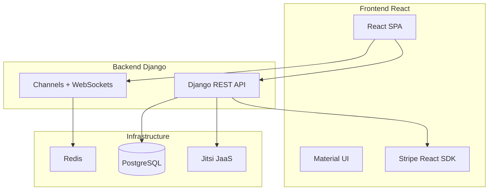

# Mathmentor

Tutoring platform connecting students with tutors. Supports scheduled sessions, instant help, messaging, and Jitsi video calls.

## Tech Stack

| Layer | Technology |
|-------|------------|
| Frontend | React, Material UI, Stripe React SDK |
| Backend | Django REST Framework, Channels (WebSockets) |
| Database | PostgreSQL |
| Message Layer | Redis (Channels) |
| Payments | Stripe |
| Video | Jitsi JaaS |

## Quick Start

**Prerequisites:** Python 3.8+, Node.js, PostgreSQL, Redis

1. **Backend**
   ```bash
   cd backend
   python3 -m venv venv && source venv/bin/activate
   pip install -r requirements.txt
   cp .env.example .env   # Edit with your values
   python manage.py migrate
   python manage.py runserver
   ```

2. **Redis** (required for WebSockets)
   ```bash
   redis-server
   ```

3. **Frontend**
   ```bash
   cd frontend
   npm install
   # Create .env with REACT_APP_API_URL and REACT_APP_WS_URL (see docs/SETUP.md)
   npm start
   ```

See [docs/SETUP.md](docs/SETUP.md) for detailed setup and environment variables.

## Project Structure

```
Mathmentor/
├── backend/       # Django REST API + WebSockets
├── frontend/      # React SPA
├── docs/          # Setup, deployment, troubleshooting
└── certs/         # TLS certs (not in repo; see docs)
```

## Documentation

- [Setup Guide](docs/SETUP.md) - Step-by-step installation and configuration
- [Deployment](docs/DEPLOYMENT.md) - Production deployment notes
- [PostgreSQL Setup](docs/postgres_setup.md) - Database setup on Debian VPS
- [Messaging](docs/MESSAGING.md) - Redis/WebSocket configuration for chat

## Architecture


